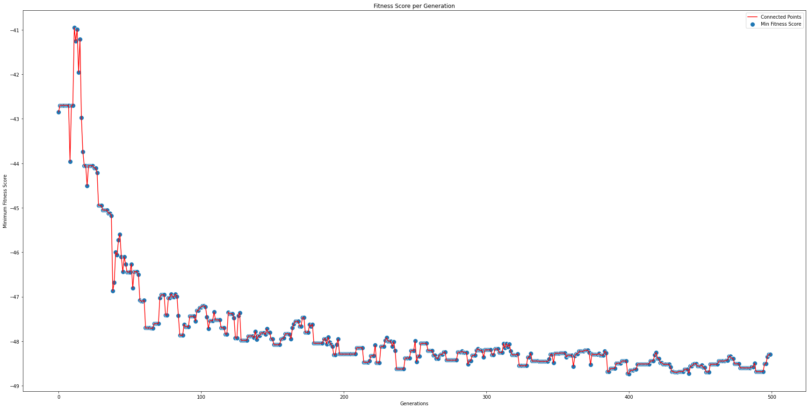

# Portfolio Optimization with Differential Evolution

This is an implementation of portfolio optimization using differential evolution technique. Different model type is considered. Both risk and return is considered for the optimization. This is based on `Differential Evolution` algorithm mentioned in paper by Rainer Storn and Kenneth Price.

The algorithm is based on - https://www.researchgate.net/publication/227242104_Differential_Evolution_-_A_Simple_and_Efficient_Heuristic_for_Global_Optimization_over_Continuous_Spaces

The model types is referred from - https://scholar.rose-hulman.edu/cgi/viewcontent.cgi?article=1193&context=rhumj

</img>
